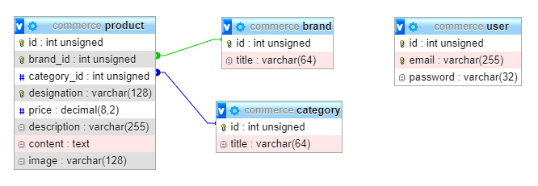

eCommerce en PHP procédural
===

Le but de projet est de développer une boutique en ligne en PHP procédural.

## Installation

Cloner ce projet :

    git clone https://github.com/ekyna-learn/php-ecommerce.git commerce
    cd commerce

Dans PhpMyAdmin, créer une base de données nommée commerce et importer 
[ce fichier](https://github.com/ekyna-learn/php-ecommerce/blob/master/doc/commerce.sql). 

Voici le schema de la base de données. 

Les images des produits se trouvent dans le dossier _images_.

## Partie publique

1. Développer la page d'__Accueil__ _(index.php)_.

    * __Afficher__ les 3 derniers __produits__ _(par identifiants descendant)_.
    En ajoutant dans chaque vignette les informations suivantes :
        * Image
        * Désignation
        * Description (utiliser la fonction [substr](https://www.php.net/manual/fr/function.substr.php) pour tronquer)
        * Prix
    
    * Ajouter aux liens _&laquo; En savoir plus &raquo;_, l'URL suivante :
        
            detail.php?id=<product.id> 
        
        en remplaçant _<product.id>_ par l'identifiant du produit.
        
    * Ajouter aux liens _&laquo; Ajouter au panier &raquo;_, l'URL suivante :
        
            ?add_to_cart=<product.id> 
        
        en remplaçant _<product.id>_ par l'identifiant du produit.
    
2. Développer la page __Catalogue__ _(browse.php)_.

    * __Afficher__ les 9 derniers __produits__ _(par identifiants descendant)_.
    * Dans le formulaire de gauche, __ajouter__ les _&lt;options&gt;_ pour les __marques__.
    * __Filtrer__ les produits affichés d'après la __marque sélectionnée__.
    * Dans le formulaire de gauche, __ajouter__ les _&lt;options&gt;_ pour les __catégories__.
    * __Filtrer__ les produits affichés d'après les __catégories sélectionnées__.
    * __Trier__ les produits affichés d'après le __tri sélectionné__.
    
3. Développer la page __Détail produit__ _(detail.php)_.

    * __Afficher__ les informations du __produit__ :
        * Image
        * Désignation
        * Marque et catégorie
        * Description
        * Prix
        * Contenu

4. Développer le panier.

    * __Stocker__ dans la variable superglobale __$_SESSION__ les __produits__ ajoutés au panier :
    lorsque le paramètre __add_to_cart__ est défini dans la variable superglobale __$_GET__. 

5. Développer la page panier _(cart.php)_.

    * __Afficher__ les produits contenu dans le __panier__ et le __total__.
    
6. Aller plus loin :

    * Gérer la quantité d'articles ajoutés au panier.
    * Dévelopepr l'administration (dossier _admin_).
